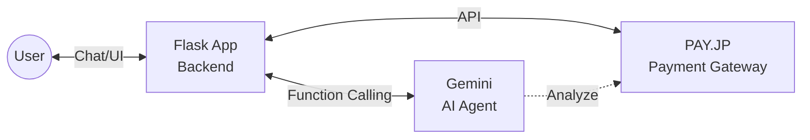
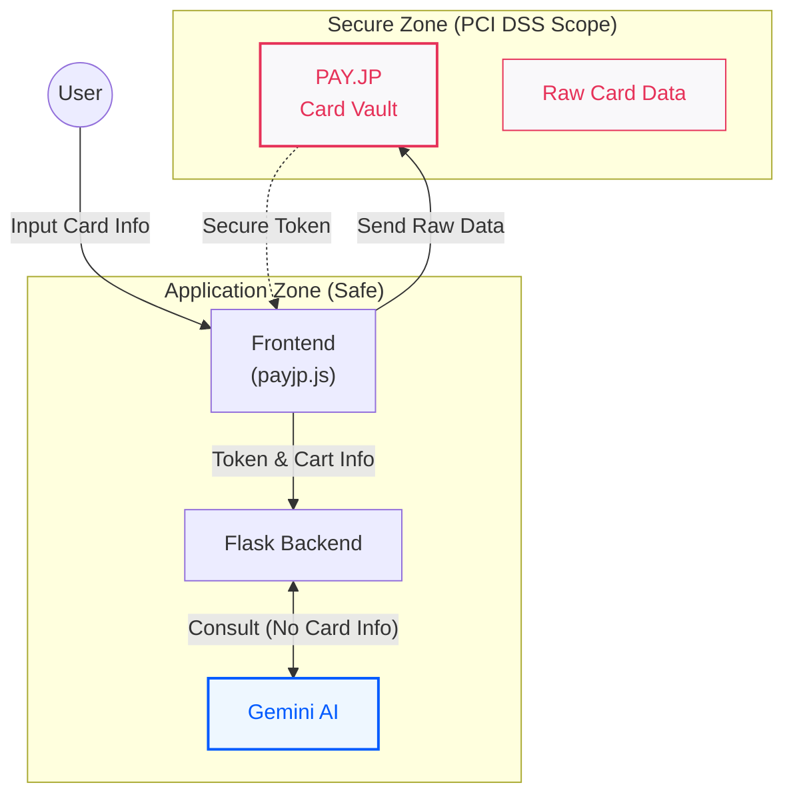

# はじめに

**「この買い物、どのカードで支払うのが一番お得なんだっけ……？」の解決を目指して！**

こんにちは、[どろみち](https://qiita.com/doromichi9)といいます。
この記事は [PAY.JP Advent Calendar 2025](https://qiita.com/advent-calendar/2025/payjp-01) の記事です。

みなさん、クレジットカードは何枚持っていますか？
楽天カード、三井住友カード、Amazon Mastercard、交通系Viewカード……。
「特定の日にお得」「特定のショップで還元率UP」「キャンペーン期間中」など、特典が複雑すぎて「今の決済に最適なカード」を判断するのは、とても面倒ではないでしょうか。


また、私はPAY.JPを知って「決済機能自体の実装」は驚くほど簡単だと知りました。
だからこそ思ったのです。**「ただ決済できるだけのECサイトはもう当たり前。その周辺にどんなサービスがあれば、ユーザーにとって本当に魅力的な体験になるだろう？」**

そこで今回は、単純な決済実装を超えて、
**「AIエージェントが、複雑なカード特典やキャンペーン情報を管理し、買い物のたびに『今のあなたにはこのカードが最適ですよ』と提案してくれる世界」**
を目指して実装してみました。

もし、自分専用のエージェントが「あ、どろみちさん。その買い物なら経費用のこのカードで、ポイントアップ中のこちらで決済しておきますね」と、ベストなクレカをさっと手渡してくれたら最高ではありませんか？？

# 目指したもの：いい感じのクレジットカードを教えてくれるエージェント

手っ取り早く、実際の動作をご覧ください。


リポジトリはこちらに公開しています：
[payjp-flask-demo](https://github.com/naotoshisasada/payjp-flask-demo)

やりたいことのイメージは次の通りです。

1. チャットで欲しい本を探します（「Pythonの入門書が欲しい」など）。
2. 気に入った本をカートに入れます。
3. いざ決済しようとすると……エージェントが **「あ、技術書ですね？今登録されているカードなら、経費用のVISAカードがおすすめですよ」**と割り込んできます。
4. ユーザーはその提案に乗っかるだけで、スムーズに最適なカードで決済が完了します。

ただの決済フォームではなく、**「気の利くエージェント」**が間にいてくれる感じです。

# アーキテクチャ

仕組みはシンプルです。PAY.JPの使いやすいAPIと、チャットボット部分はGeminiを用いました。

- **Backend**: Python (Flask)
- **AI Model**: Google Gemini
- **Payment**: PAY.JP API
- **Frontend**: HTML/CSS/JavaScript



# 実装のポイント：機密情報の分離とPCI DSS

今回、AIエージェントに決済を任せる上で最も注意したのが、**「機密性の高い情報と、そうでない情報の厳密な分離」**です。



## 1. PCI DSSとバックエンドの役割
クレジットカード業界のセキュリティ基準「PCI DSS」の観点から、**生のクレジットカード情報はバックエンド（Flaskサーバー）には一切渡してはいけません。**
カード番号の入力やトークン化は、すべてフロントエンド（ブラウザ）上で、PAY.JPが提供するセキュアなライブラリ（PAY.JP Checkoutなど）を用いて完結させる必要があります。

バックエンドが受け取るのは、安全化された「トークン」や、マスキングされた（伏せ字の）カード情報のみです。これにより、意図せずクレジットカード情報が漏洩するリスクを排除しています。

## 2. 機密情報はPAY.JPのみ。非機密情報はGeminiでも扱えること
この設計のおかげで、**GeminiAIは生のカード情報を一切知ることなく動作します。**
もしAIがカード番号を知ってしまったら、ハルシネーション（嘘の出力）でチャット欄に他人のカード番号を表示してしまう……なんて事故が起きかねませんが、その心配はありません。

Geminiには、以下のルールでToolの使用権限を与えています。

*   **機密性の高い情報（カード番号など）**: Geminiはアクセス不可。PAY.JP側で厳重に管理。
*   **機密性の低い情報（特典、ポイント還元率など）**: GeminiがToolを通じてアクセス可能。

今回はデモとして、カードごとの特典情報（「このカードは技術書で5%還元」など）は**環境変数**等で管理し、GeminiがToolの中でそこから情報を引けるように実装しました。

```python
# .env / 環境変数の設定例（デモ用）
CARD_INFO=[
  {
    "id": "visa_card",
    "brand": "Visa",
    "issuer": "三井住友カード",
    "number": "4242424242424242", # デモ用のダミー番号
    "exp_month": "12",
    "exp_year": "2030",
    "cvc": "123",
    "name": "TARO YAMADA",
    "feature": "基本還元率1.0%", # Geminiが参照する情報
    "reward_rate": 1.0,         # Geminiが参照する情報
    "condition_type": "none"
  }
]
```

ここで重要なのが **PAY.JPのセキュリティ設計** です。
もし「AIにカード番号を読ませて判断させる」なんて実装だったら、セキュリティ的に大問題です（ハルシネーションで番号を漏らすかもしれませんしね）。

しかし、PAY.JPではカード情報は安全にトークン化・ID化されて管理されています。
おかげで、AIに渡す情報はあくまで **「カードのID」「ブランド」「ラスト4桁」「メタデータ（用途メモ）」** だけで済みます。

未実装ですが、例えばユーザーがカード登録時に「これは経費」「これはプライベート」といったメモ（metadata）を残しておけば、AIはそれを見て判断できるわけです。

## 3. 今後の課題
今回はデモ実装のためシンプルに作りましたが、より本格的な運用を考えるならば、「フロントエンド側でどのように情報を保持し、どのタイミングでGeminiに渡すか」はもっと精査が必要です。
利便性を高めつつ、セキュリティの境界線をどこに引くか。ここはAI決済アプリを作る上での一番の腕の見せ所だと感じました。


# エージェントの「おせっかい」ロジック

今回一番こだわったのが、AIの **「おせっかい」な振る舞い**です。

通常のECサイトなら、デフォルトのカードで黙って決済します。
しかしこのエージェントは、決済の直前で一度立ち止まり、カートの中身とカード情報を分析して**「ユーザーにとって最も利益が出る選択」**を提案しようとします。

## 具体例：ポイント還元率の最大化

例えば、あなたが何か買い物を、特に金額の大きなものを買おうとしている場面を想像してください。

1.  **カート分析**: 「○○社の本が3冊……合計12,000円。書籍カテゴリだな。」
2.  **カード照合**:
    *   Visaカード（基本還元率 1.0%）
    *   **Tech Card（現在、書籍購入ポイントアップキャンペーン中で還元率 5.0%！）**
3.  **提案生成**: 「**○○社 の本を-tech-card-で購入ですね。Tech Cardなら現在特約店キャンペーン中で600ポイントもお得につきますよ？**こちらに変更しますか？」

このように、「損をしない選択」をエージェントが肩代わりしてくれるのです。

## 将来的な野望：用途の自動仕分け
さらに将来的には、カードごとに「これは経費」「これはプライベート」といったタグ（metadata）を付与し、「技術書だから経費カードで落とす」といった自動仕分けも実現したいと考えています。

### 求む！「おせっかい」のアイデア
今回は「お得さ」と「用途」に着目しましたが、AIエージェントにはもっと面白い「おせっかい」ができるはずです。
「こんな機能があったら便利！」「いや、それは邪魔すぎる（笑）」など、**「AI店員にやってほしい振る舞い」のアイデアがあれば、ぜひコメントで教えてください！**
面白そうなものは、第2弾として実装してみたいと思います。

# まとめ：決済機能のその先へ

今回、PAY.JPとGeminiを組み合わせてみて感じたのは、**「APIがこれだけシンプルだと、AIに『手足』として持たせるのが非常に簡単だ」**ということです。

これまでは「いかに簡単に決済を導入するか」が焦点でしたが、これからは **「決済を起点に、ユーザーにもっと価値のある体験をどう提供していくか」**を競うフェーズに入っていくのかもしれません。
AIエージェントが、ユーザーに代わって「お得」や「便利」を追求してくれる。そんな未来のEC体験の片鱗を感じることができました。

もし、この記事が皆さんのお役に立ちましたら、ぜひ「いいね」をお願いします！
---

## PAY.JPへの期待：認証基盤との連携

最後に、開発者としてのPAY.JPへの期待を少しだけ。
PAY.JPは非常に手軽に決済を組み込める素晴らしいツールですが、「ユーザーの意思でクレジットカード情報を安全に登録・管理する」部分の実装は、セキュリティ要件も含めて依然としてハードルがあります。

もし、何らかの一般的な認証基盤と連携し、**「ユーザーが一度登録したカード情報を、ユーザーの許可のもとで様々なサービスから安全に呼び出せる仕組み」**などが公式にサポートされれば、我々開発者はもっと気軽に、いろいろな場所へPAY.JPを組み込めるようになるのではないかと夢見ています。

---
